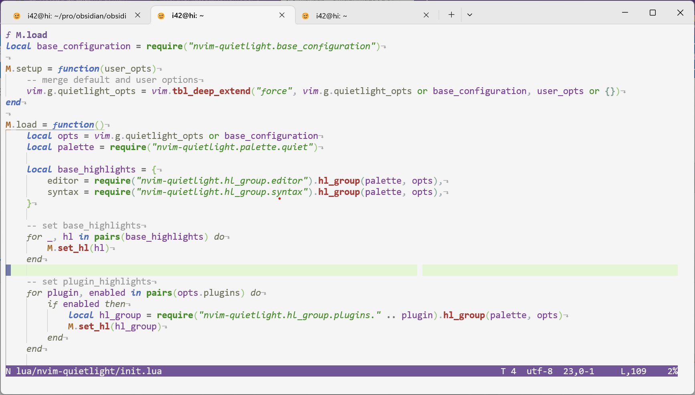

<section align="center">
  
  <br>
  <p align="center">quietlight 主题源自 <a href="https://github.com/microsoft/vscode/blob/main/extensions/theme-quietlight/themes/quietlight-color-theme.json">vscode quietlight theme</a> 和 <a href="https://github.com/aonemd/quietlight.vim">quietlight.vim</a>
  </p>
  <hr>
</section>

<table align="center">
  <tr>
    <td>
      
    </td>
    <td>
      
    </td>
  </tr>
  <tr>
    <td>
      
    </td>
    <td>
      
    </td>
  </tr>
</table>
<br>

状态栏插件：[**lualine.nvim**](https://github.com/nvim-lualine/lualine.nvim)， Tab插件：[**bufferline.nvim**](https://github.com/akinsho/bufferline.nvim)，winbar插件：[**winbar.nvim**](https://github.com/fgheng/winbar.nvim)

## 准备

1. Neovim v0.7.0 或更高的版本，不支持VIM，要VIM支持的quietlight可以看这个[quietlight.nvim](https://github.com/aonemd/quietlight.vim)
2. 终端最好支持真彩 （`vim.opt.termguicolors = true`），不支持真彩就只能用 ANSI-256色了

## 安装与使用

通过nvim插件管理器packer安装，方法如下：

```lua
use("HUAHUAI23/nvim-quietlight") -- packer.nvim
```

设置nvim主题，下面将使用quietlight的默认配置

```lua
vim.opt.background = 'light'
vim.cmd('colorscheme quietlight')
-- add this for disable colorcolumn
vim.cmd("highlight clear ColorColumn")
```

## 配置

下面是quietlight的默认设置，这些设置可以被用户自定义。

```lua
require("nvim-quietlight").setup({
 ansi_terminal_colors = "",  -- "colors1", "colors2" or "colors3"
 transparent_background = false,
 dim_inactive_windows = {
  enabled = false,
  color = nil,
 },
 syntax = {
  booleans = {}, --{ bold = true, italic = true } or { fg = "#xxxxxx", bg="#xxxxxx" }
  comments = {}, -- see nvim.api.nvim_set_hl  https://neovim.io/doc/user/api.html
  identifiers = {},
  statements = {},
  conditionals = {},
  constants = {},
  fields = {},
  functions = {},
  keywords = {},
  loops = {},
  numbers = {},
  operators = {},
  punctuation = {},
  strings = {},
  types = {},
  preproc = {},
 },
 plugins = {
  gitsigns = true,
  lsp = true,
  bufferline = true,
  treesitter = true,
  notify = true,
  nvimtree = true,
  indentline = true,
 },
})
```

必须在 `:colorscheme quietlight` 设置nvim主题前调用 `setup` 函数来对quietlight进行配置，否则用户配置不会生效，将会使用默认配置

> 配置项如果是空表 (`table`)，例如 `statements = {}` 将会使用默认配置

你可以制作自己的插件高亮组，然后放在[这里](https://github.com/HUAHUAI23/nvim-quietlight/tree/main/lua/nvim-quietlight/hl_group/plugins)  
window terminal [主题](./extras/terminal/theme.json)
