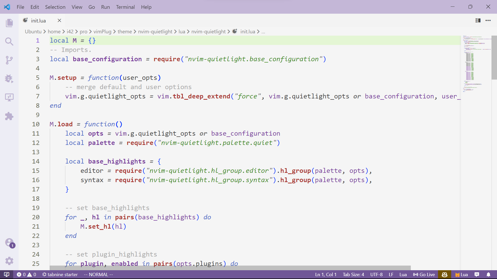
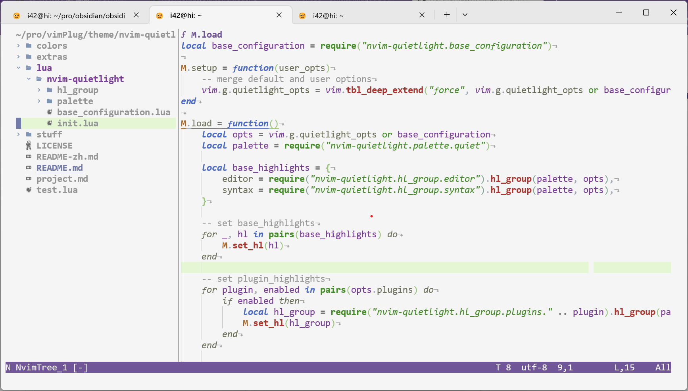

# quietlight.nvim

<b><font color="#484848" >The VScode quietlight theme is one of my favorite thmemes, this theme is generate from it, and add some stuff i like, see <a href="https://github.com/microsoft/vscode/blob/main/extensions/theme-quietlight/themes/quietlight-color-theme.json">vscode quietlight theme</a> and <a href="https://github.com/aonemd/quietlight.vim">quietlight.vim</a> for more</font></b>

---


 <center><b><font color="#484848" >VScode quietlight</font></b></center>


 <center><b><font color="#484848" >nvim-quietlight</font></b></center>

 

 <center><b><font color="#484848" >nvim-quietlight</font></b></center>

[**lualine.nvim**](https://github.com/nvim-lualine/lualine.nvim) for statusline, [**bufferline.nvim**](https://github.com/akinsho/bufferline.nvim) for tabline, and [**winbar.nvim**](https://github.com/fgheng/winbar.nvim) for winbar

## Requirements

- Neovim v0.7.0 or higher.

> Note: Some plugin integrations (treesitter) require Neovim v0.8. If your Neovim version doesn't support a plugin integration,nvim-quietlight displays a warning message when enabling that integration. Use Neovim [v0.8.0](https://github.com/neovim/neovim/releases/tag/v0.8.0) or higher.

- Don't support VIM, if you want vim verison supported see [quietlight.nvim](https://github.com/aonemd/quietlight.vim)

- A terminal with true colour support will well although nvim-quietlight support ANSI terminal colors

## Installation

Install nvim-quietlight with your favorite package manager

```lua
use("HUAHUAI23/nvim-quietlight") -- packer.nvim
```

## Usage

To use nvim-quietlight's default configuration, add the following to your Neovim configuration:

```lua
vim.opt.background = 'light'
vim.cmd('colorscheme quietlight')
-- add this for disable colorcolumn
vim.cmd("highlight clear ColorColumn")
```

## Configuration

default configuration:

```lua
{
 transparent_background = false,
 dim_inactive_windows = {
  enabled = false,
  color = nil,
 },
 syntax = {
  booleans = {}, --
  comments = {},
  identifiers = {},
  statements = {},
  conditionals = {}, --
  constants = {},
  fields = {}, --
  functions = {},
  keywords = {},
  loops = {},
  numbers = {}, --
  operators = {},
  punctuation = {}, --
  strings = {},
  types = {},
  preproc = {},
 },
 plugins = {
  gitsigns = true,
  lsp = true,
  bufferline = true,
  treesitter = true,
 },
}
```
